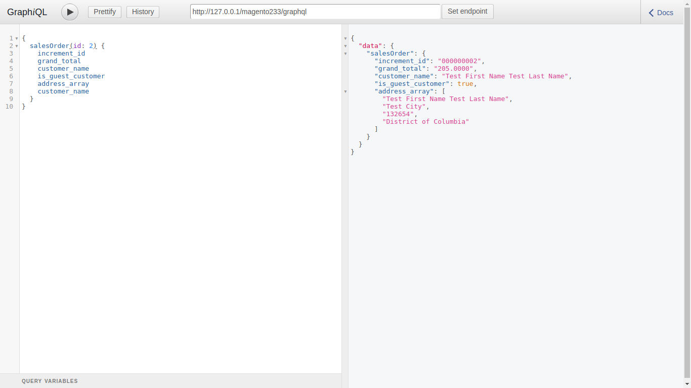

Magento2 GraphQl

## Supports


- Magento 2.3.x

Required to run the following commands in Magento 2 root folder:

```
php bin/magento setup:upgrade
php bin/magento setup:static-content:deploy
php bin/magento cache:clean
```

### Install via zip

* [Download the latest version from GitHub](https://github.com/vrajeshkpatel/magento2-graphql)

You can check your GraphQL query response by installing chrome extension ChromeiQL or Altair GraphQL addon.

### 1 Sales Order Data

Check using http://127.0.0.1/magento233/graphql url. 

```
{
  salesOrder(id: 2) {
    increment_id
    grand_total
    customer_name
    is_guest_customer	    
    address_array
    customer_name
  }
}
```
### Result 

