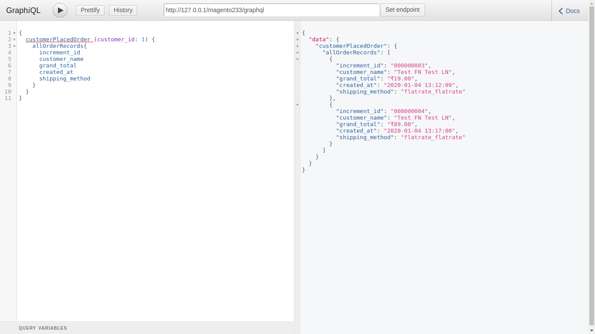
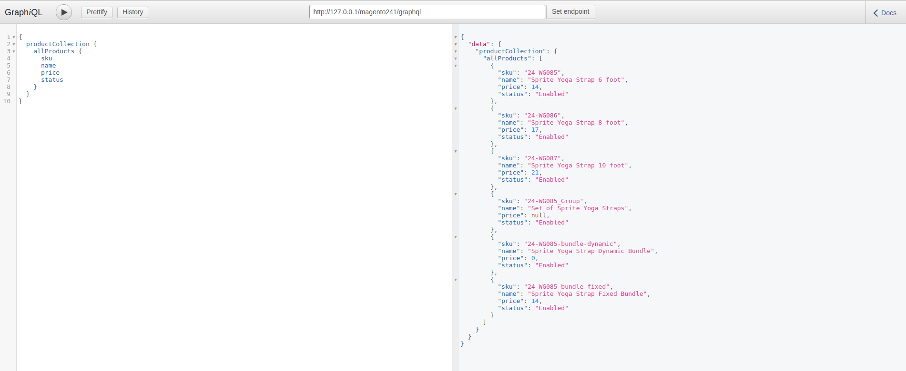
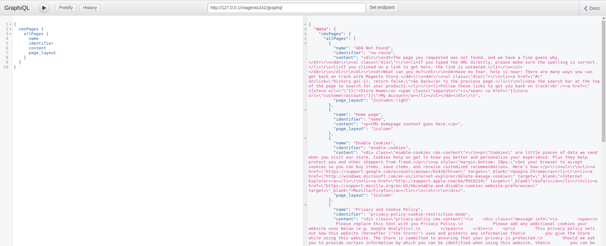

Magento2 GraphQl

## Supports


- <b>Supports : Magento 2.0.x, 2.1.x, 2.2.x, 2.3.x and 2.4.x</b>

Required to run the following commands in Magento 2 root folder:

```
php bin/magento setup:upgrade
php bin/magento setup:static-content:deploy
php bin/magento cache:clean
```

### Install via zip

* [Download the latest version from GitHub](https://github.com/vrajeshkpatel/magento2-graphql)

You can check your GraphQL query response by installing chrome extension ChromeiQL or Altair GraphQL addon.

### 1 Sales Order Data

Check using http://127.0.0.1/magento241/graphql url. 

```
{
  salesOrder(id: 2) {
    increment_id
    grand_total
    customer_name
    is_guest_customer	    
    address_array
    customer_name
  }
}
```
### Result 


### 2 Customer Order Placed Data

Check using http://127.0.0.1/magento241/graphql url. 

```
{
  customerPlacedOrder (customer_id: 1) {
    allOrderRecords{
      increment_id
      customer_name
      grand_total
      created_at
      shipping_method
    }
  }
}
```
### Result 


### 3 Get Product collection

Check using http://127.0.0.1/magento241/graphql url. 

```
{
  productCollection {
    allProducts {
      sku
      name
      price
      status
    }
  }
}
```
### Result 


### 3 Get CMS Page collection

Check using http://127.0.0.1/magento241/graphql url. 

```
{
  cmsPages {
    allPages {
      name
      identifier
      content
      page_layout
    }
  }
}
```
### Result 
